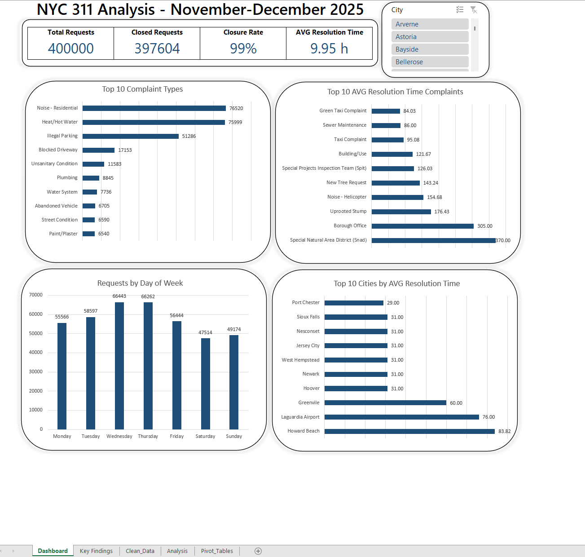

# NYC 311 Service Requests Analysis

## Project Overview

This project analyzes NYC 311 service requests from November–December 2025.

The main objective of the project was not only to explore the dataset itself, but primarily to become more familiar with using Excel for data analysis, data transformation, reporting, and dashboard creation.

The project focuses on building a complete Excel workflow, including importing and cleaning data with Power Query, creating PivotTables and PivotCharts, calculating KPIs, and presenting the results in a dashboard.

---

## Data Source

**NYC Open Data - 311 Service Requests**

The data was imported directly into Excel using Power Query.

**Period analyzed:**  
November–December 2025

---

## Data Preparation

The raw dataset was imported from the NYC Open Data API using Power Query.

The following transformations were performed:

- selected relevant columns
- changed data types
- handled missing values
- cleaned text fields
- removed unnecessary columns
- calculated resolution time
- prepared the dataset for PivotTable analysis

---

## Analysis Performed

The project focuses on the following questions:

- What are the most common complaint types?
- Which days of the week receive the most requests?
- Which complaint types have the highest average resolution time?
- Which locations have the highest average resolution time?
- What percentage of requests were successfully closed?

---

## Key Findings

- The three most common complaint types - Noise - Residential, Heat/Hot Water, and Illegal Parking - accounted for approximately 51% of all service requests.

- Request volume peaked in the middle of the week, with Wednesday and Thursday recording the highest number of requests.

- Approximately 99% of requests were closed during the analyzed period.

- The overall average resolution time was approximately 9.95 hours.

- Resolution times varied significantly across complaint types, with some categories taking substantially longer to resolve than the overall average.

- Request volume and resolution time did not necessarily move together, meaning that the most common complaint types were not always the slowest to resolve.

---

## Limitations

- The analysis covers only a two-month period and therefore does not represent full-year trends or seasonality.

- An initial idea was to compare the number of requests with population data and calculate requests per capita. This was not included in the final version because adding the additional population dataset significantly increased the size of the Excel data model and was outside the main scope of the project.

- Average resolution time can be strongly affected by locations or complaint categories with very small numbers of requests.

- In some cases, a location may have a very high average resolution time based on only one or a few service requests. Because of this, average resolution time rankings should be interpreted carefully.

- The analysis is based on the information available in the NYC 311 dataset and does not directly measure service quality.